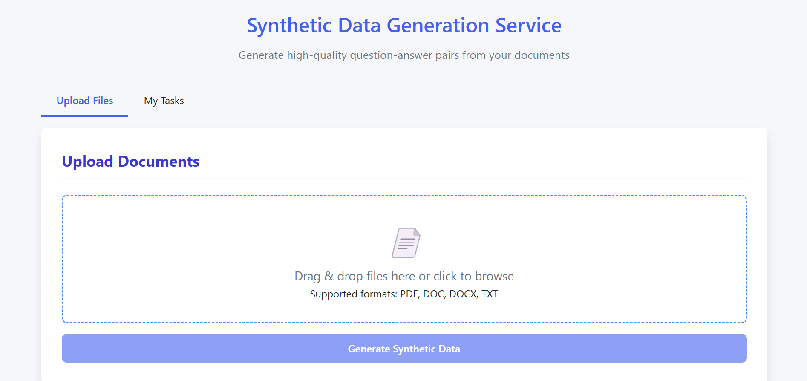

# Synthetic Data Generation Service

A web-based service that generates high-quality question-answer pairs from your documents using LLM technology.



## Overview

This service allows you to upload documents (PDF, DOC, DOCX, TXT) and automatically generates synthetic question-answer pairs based on the content. It's perfect for creating training data for chatbots, search engines, or other NLP applications.

## Features

- **Document Processing**: Upload and process PDF, DOC, DOCX, and TXT files  
- **Intelligent QA Generation**: Uses Ollama LLM to create contextually relevant question-answer pairs  
- **Quality Control**: Automatically evaluates and filters QA pairs based on quality scores  
- **Task Management**: Track the progress of your generation tasks  
- **Preview Results**: View sample QA pairs before downloading the full dataset  
- **Downloadable Results**: Get your synthetic data in JSON format for easy integration  

## Architecture

The service consists of:

- FastAPI backend for document processing and LLM integration  
- Web-based UI for file uploads and task management  
- Ollama integration for local LLM inference  
- Background task processing for handling large documents  

## Prerequisites

- Python 3.8+  
- Ollama installed and running locally (or accessible via network)  
- Docker (optional, for containerized deployment)  

## Installation

### Option 1: Local Installation

```bash
git clone https://github.com/yourusername/simple-synthetic-data-generation.git
cd simple-synthetic-data-generation # Clone the repository
python -m venv venv # Create virtual environment
.venv\Scripts\activate | source .venv/bin/activate # Activate virtual environment
pip install -r requirements.txt # Install dependencies
copy .env.example .env # Rename to .env
uvicorn main:app --host 0.0.0.0 --port 8000 --reload # Start the server
```

Edit the `.env` file to match your environment settings.

### Option 2: Docker Installation

```bash
docker build -t synthetic-data-generator .
docker run -p 8000:8000 -v ./uploads:/app/uploads -v ./temp_results:/app/temp_results synthetic-data-generator
```

## Configuration

The service can be configured through environment variables in the `.env` file:

| Variable              | Description                             | Default         |
|-----------------------|-----------------------------------------|-----------------|
| CHUNK_SIZE            | Size of text chunks for processing      | 1500            |
| CHUNK_OVERLAP         | Overlap between chunks                  | 200             |
| MAX_RETRIES           | Maximum retries for LLM requests        | 7               |
| TIMEOUT               | Timeout for LLM requests (ms)           | 1000            |
| MAX_REQUESTS_PER_MIN  | Rate limiting for LLM requests          | 500             |
| OLLAMA_MODEL          | Ollama model to use                     | gemma3:latest   |
| OLLAMA_BASE_URL       | URL for Ollama API                      | localhost:11434 |
| MIN_QUALITY_SCORE     | Minimum quality score for QA pairs (1-5)| 3               |
| QA_PER_CHUNK          | Number of QA pairs per chunk            | 2               |

## Usage

Start the server:

```bash
uvicorn main:app --reload
```

Navigate to `http://localhost:8000`, upload documents, monitor progress, and download results.

## API Endpoints

- `GET /`: Main web interface  
- `POST /generate`: Upload files and start generation  
- `GET /task/{task_id}`: Get task status and progress  
- `GET /task/{task_id}/download`: Download generated QA pairs  

## Output Format

```json
{
  "qa_pairs": [
    {
      "question": "What is the recommended dosage for adults?",
      "answer": "The recommended dosage for adults is 10mg taken twice daily.",
      "context": "For adult patients, administer 10mg twice daily with meals. Pediatric patients should receive 5mg twice daily.",
      "source": "medication_guide.pdf"
    }
  ],
  "errors": []
}
```

## Limitations

- QA quality depends on Ollama model used  
- Processing large documents may take time  
- Results stored for 3 days before deletion  

## Troubleshooting

- Ensure Ollama is running and accessible  
- For memory errors, reduce `CHUNK_SIZE`  
- Try a different Ollama model or increase `MIN_QUALITY_SCORE` for better output  

## License

[MIT License](LICENSE)

## Acknowledgements

- Uses [Ollama](https://ollama.com/) for LLM inference  
- Built with [FastAPI](https://fastapi.tiangolo.com/) and [LangChain](https://www.langchain.com/)  
